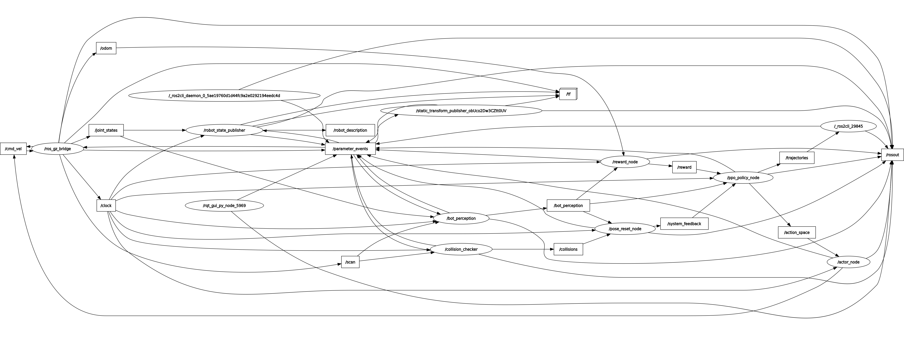
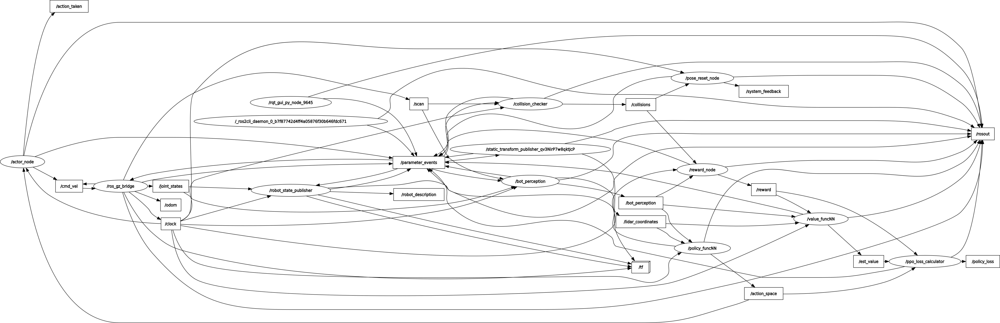

# rl_race

🚗 **rl_race** is a **ROS 2 package** for reinforcement learning in autonomous racing tasks.

This project implements a **custom PPO (Proximal Policy Optimization) training architecture** built entirely with neural networks—**without relying on pre-built RL wrappers** such as Gymnasium or Stable Baselines 3.

The simulation backend is powered by **Ignition Gazebo Fortress** and integrates directly with ROS 2 nodes for training, perception, and control.

<p align="center">
  
</p>

---

## ✨ Features

- **Custom PPO Implementation**
    - Actor-Critic neural networks implemented from scratch in Python.
    - Separate ANN and CNN policy options (`PPO_policy_ANN.py`, `PPO_policy_CNN.py`).
    - Tailored reward and loss functions (`PPO_reward_func.py`, `PPO_loss.py`).
    - Checkpointing and bias saving (`biases/value_NN.pth`).
- **ROS 2 + Ignition Gazebo Fortress Integration**
    - Training runs entirely in Ignition Gazebo Fortress simulation.
    - ROS 2 nodes for perception, odometry, lane detection, and collision checking.
    - Launch files for different workflows (training, mapping, racing, data capture).
- **No External RL Libraries**
    - No Gymnasium or SB3.
    - Direct interaction between simulation and PPO loop.
- **Visualization & Debugging Tools**
    - Center line visualization (`center_line_viz.py`).
    - Learning curve visualization (`learning_viz.py`).
    - Odometry and trajectory visualization (`visualize_odometry.py`).
    - Episode logging in multiple formats (`.npy`, `.json`, `.txt`).
- **Multi-Agent Ready (Future Extension)**
    - Modular structure for adding additional agents or multi-robot scenarios.

---

## 📂 Package Structure

```bash
rl_race
├── launch/              # ROS 2 launch files
├── scripts/             # Python RL training & visualization scripts
├── src/                 # C++ ROS 2 perception & environment nodes
├── srv/                 # Custom service definitions (e.g. SetPose)
├── trajectories/        # Logged training data
├── urdf/                # Robot description (F1 racecar)
├── worlds/              # Gazebo world files & tracks
├── biases/              # Saved trained weights
├── include/             # C++ headers
├── rl_race/             # Python ROS nodes
├── RL_archi.png         # Architecture diagram
├── CMakeLists.txt       # ROS 2 build configuration
├── package.xml          # ROS 2 package manifest
├── setup.py             # Python setup script

```

---

## 🏗️ Installation

### Prerequisites

- **ROS 2 Humble** (recommended)
- **Ignition Gazebo Fortress**
- **Python 3.10+**
- Dependencies:
    
    ```bash
    sudo apt install ros-humble-ros-gz-bridge ros-humble-rclpy python3-numpy python3-torch python3-matplotlib
    
    ```
    

### Build

Clone into your ROS 2 workspace:

```bash
cd ~/ros2_ws/src
git clone https://github.com/your-username/rl_race.git
cd ~/ros2_ws
colcon build --packages-select rl_race
source install/setup.bash

```

---

## 🚀 Usage

### 1. Start Gazebo World

```bash
ros2 launch rl_race race.launch.py

```

### 2. Run PPO Training

```bash
ros2 launch rl_race PPO_stack.launch.py

```

### 3. Visualize Learning

```bash
ros2 run rl_race learning_viz.py

```

### 4. Teleoperation (for manual control / debugging)

```bash
ros2 run rl_race teleop_twist.py

```

---

## 📊 Training Flow

<p align="center">
  
</p>

1. **Environment**: Ignition Gazebo provides lidar & perception data.
2. **State Representation**: Lidar, centerline, and odometry data processed.
3. **Policy**: Actor network outputs velocity commands.
4. **Reward**: Based on lane keeping, progress, and collision checks.
5. **Update**: PPO loss function optimizes actor-critic networks.
6. **Trajectory Logging**: Results saved in `.npy` / `.json` / `.txt`.

---

## 📑 Launch Files Overview

- `PPO_stack.launch.py` → Full PPO training pipeline.
- `mapping_stack.launch.py` → Map generation with lidar.
- `race.launch.py` → Start racing simulation.
- `sfm_capture.launch.py` → Capture scene for mapping & dataset generation.
- `gz_bridge_config.yaml` → ROS ↔ Gazebo topic bridging.

---

## 📚 Key Files

- **PPO Implementation**
    - `PPO_actor.py` – Actor network.
    - `PPO_value_funcNN.py` – Value function network.
    - `PPO_policy_ANN.py` / `PPO_policy_CNN.py` – Policy definitions.
    - `PPO_loss.py` – PPO clipped loss implementation.
    - `PPO_reward_func.py` – Custom reward shaping.
- **ROS 2 Integration**
    - `bot_perception_node.cpp` – Processes camera/lidar.
    - `collision_checker.cpp` – Detects collisions.
    - `track_progression.cpp` – Monitors progress along track.
    - `set_pose_service.py` – Reset environment robot pose.

---

## 📈 Example Results

- Training logs stored in `trajectories/`:
    - `latest_episode_data.npy` – State-action-reward data.
    - `latest_episode_data.json` – Human-readable trajectory data.
    - `latest_episode_data.txt` – Debug output.
- Visualization examples:
    - `scripts/lidar_map.png`
    - `scripts/rl_map.png`

---

## 🤝 Contributing

Contributions are welcome!

Feel free to submit issues, pull requests, or suggestions.
